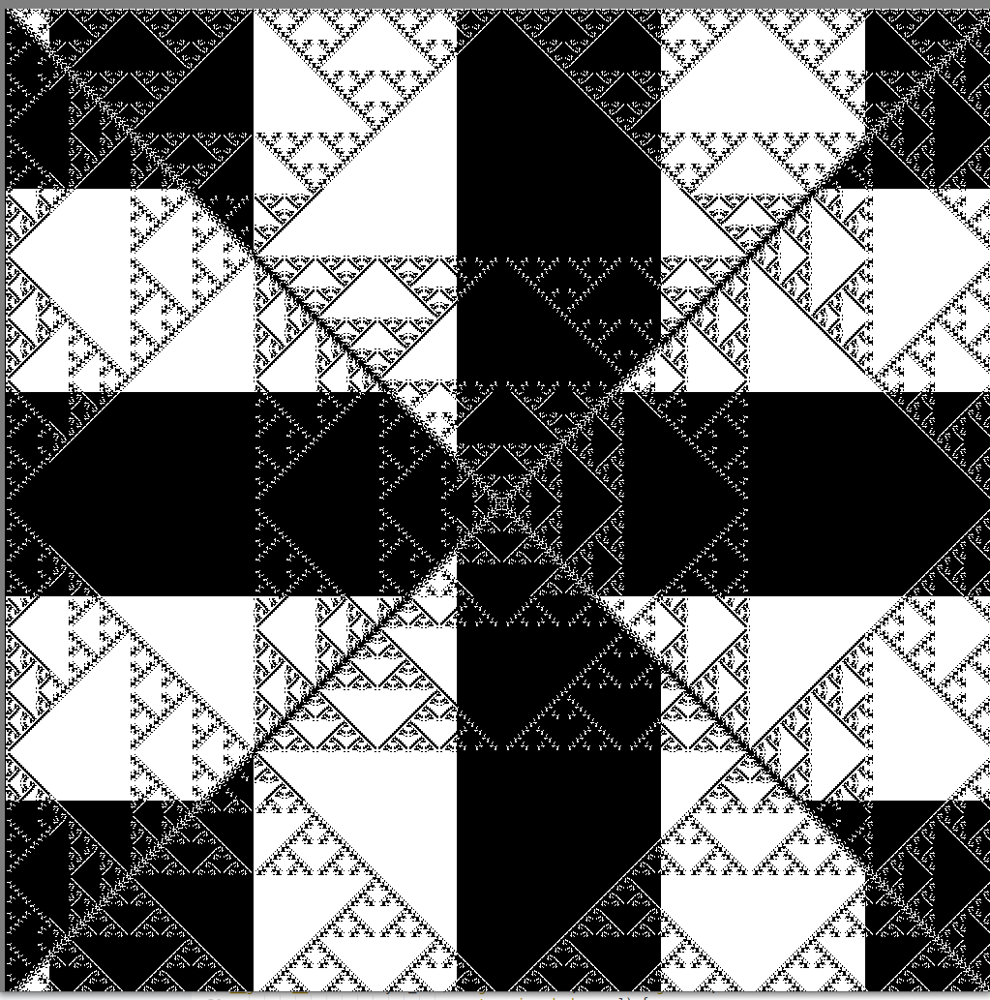

### Dependencies: 
- download cuda
- have glfw on system (`yay glfw-x11`)
- have OpenGL

### Compile
- `nvcc main.cu opengl_related.cu cuda_routines.cu glad.c -lglfw -o main`
### Run 
- `__NV_PRIME_RENDER_OFFLOAD=true __GLX_VENDOR_LIBRARY_NAME=nvidia ./main`

### How to use: 
- WASD to move 
- I and O to zoom In and Out
- press space to pause simulation
- left click with mouse to place life

### Images

Normal game of life ruleset:

Trying out a weird rule, 1-dead, 2-same, 3-alive, else-dead

Inkblot-like pattern from 0,1,2,3-alive, else-dead (this one flashes violently)

Eye of the abyss: 

(middle:)

infection like infinite spreading:

grid spawning more grids: 1-alive, else-dead

screenshot from same rules: 

fractally one: 0-dead, 1-alive, 2-same, 3-same, else-dead  

sandy one: 0-same, 1-same, 2-same, 3-alive, else-dead

cheese: 0-alive, 1-same, 2-same, 3-same, 4-dead, else-alive

diamond: 0-alive, 1-same, 2-same, 3-dead, 4-dead, else-alive  

systemic: 0-alive 1-dead, 2-same, 3-same, 4-dead, 5-dead, else-alive  

pyramid: 0-alive 1-dead, 2-same, 3-same, 4-dead, 5-dead, 6-dead else-alive  

pascal's triangle: 

### facts:

- OLD: gets around 30 fps currently at startup when doing 2048x2048 cells
- Single buffering doesn't seem to work on Nvidia gpu?

### PERFORMANCE HISTORY

- with raylib and a 2048x2048 canvas with no optimizations and NO CELL TRANSFORMING - getting 36 FPS, while 290 fps at -O3

- with glfw + OpenGL + copying CUDA data to SSBO with floats for cells, indexed in fragment shader and a 2048x2048 canvas with no optimizations and NO CELL TRANSFORMING - getting 120 FPS, while 350 fps at -O3

- as previous, but now CUDA data is sent directly to SSBO, shader does bit manipulation of 32 uints to turn them into bools - getting 800 FPS at NO CELL TRANSFORMING - while 730 fps with transforming, practically no difference for -O3.

- as previous, but now we have a OpenGL SSBO (shader storage buffer object) which CUDA writes directly to, and OpenGL draws it immediately. So now the CPU basically does nothing. The shader does bit operations to get the right state of it's cell - 900 fps 

- Tested doing shared memory where blocks filled in for each other's corners, but got exact same framerate, so reverted this change

- now I have a second SSBO that I write to, to prevent race conditions - which I noticed sometimes when writing to the buffer I was also reading from at the same time. Still 900 fps, could possibly optimize it by swapping the buffers roles each frame.
